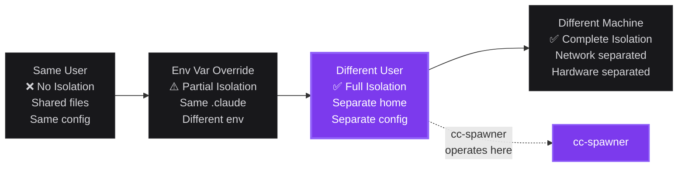
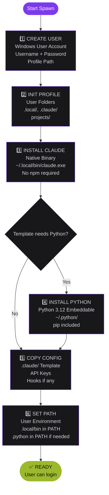
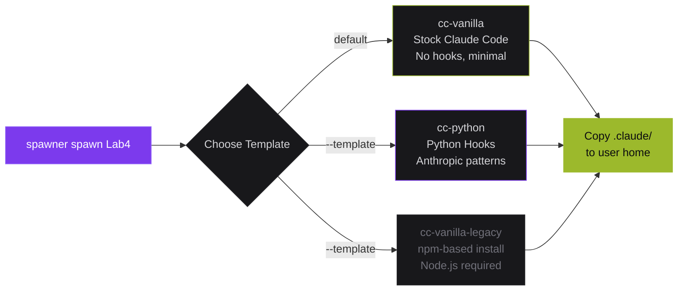
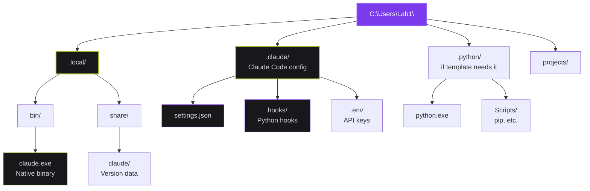
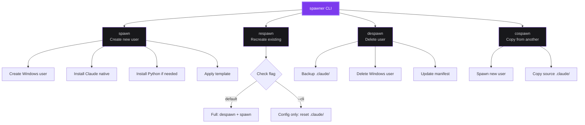
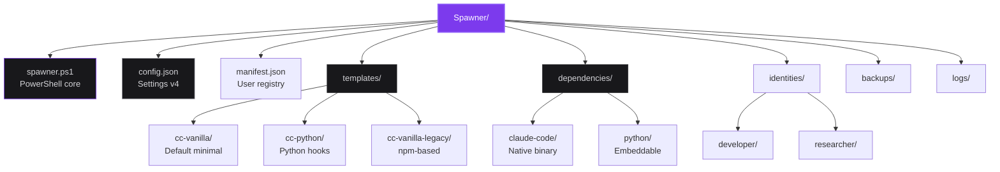

# cc-spawner Architecture Diagrams

Professional architecture diagrams for the cc-spawner project using Mermaid syntax.

---

## 1. Isolation Spectrum

Shows where cc-spawner fits in the isolation landscape.

---

## 2. Spawn Workflow (v4 - Native Install)

Six-phase process for creating a spawned user environment.

---

## 3. Templates System (v4)

Available templates for spawned environments.

---

## 4. User Environment (v4)

What gets created in each spawned user's home directory.

---

## 5. Commands Overview

Core commands and their relationships.

---

## 6. Directory Structure (v4)

Project layout and key files.

---

## Usage

### In GitHub README
Copy the Mermaid code blocks directly into markdown files. GitHub renders Mermaid automatically.

### Brand Colors Used
- **Purple**: `#7C3AED` - Primary accent, highlights
- **Steel Light**: `#D4D4D8` - Primary text
- **Dark Background**: `#0C0C0F` - Main background
- **Elevated**: `#18181B` - Card/box backgrounds
- **Border**: `#27272A` - Borders, dividers
- **Success**: `#9CB92C` - Success states, ready indicators
