# cc-spawner Architecture Diagrams

Professional architecture diagrams for the cc-spawner project using Mermaid syntax.

---

## 1. Isolation Spectrum

Shows where cc-spawner fits in the isolation landscape.

```mermaid
graph LR
    A[Same User<br/>❌ No Isolation<br/>Shared files<br/>Same config] --> B[Env Var Override<br/>⚠️ Partial Isolation<br/>Same .claude<br/>Different env]
    B --> C[Different User<br/>✅ Full Isolation<br/>Separate home<br/>Separate config]
    C --> D[Different Machine<br/>✅ Complete Isolation<br/>Network separated<br/>Hardware separated]

    C -.->|cc-spawner<br/>operates here| E[cc-spawner]

    style C fill:#7C3AED,stroke:#9061F9,stroke-width:3px,color:#fff
    style E fill:#7C3AED,stroke:#9061F9,stroke-width:2px,color:#fff
    style A fill:#18181B,stroke:#27272A,color:#D4D4D8
    style B fill:#18181B,stroke:#27272A,color:#D4D4D8
    style D fill:#18181B,stroke:#27272A,color:#D4D4D8
```

---

## 2. Spawn Workflow

Six-phase process for creating a spawned user environment.

```mermaid
graph TD
    Start([Start Spawn]) --> Step1[1️⃣ CREATE USER<br/>Windows User Account<br/>Username + Password<br/>Profile Path]
    Step1 --> Step2[2️⃣ INIT PROFILE<br/>User Folders<br/>AppData/, Desktop/<br/>Documents/]
    Step2 --> Step3[3️⃣ INSTALL NVM<br/>nvm-windows v1.2.2<br/>Portable Setup<br/>User AppData]
    Step3 --> Step4[4️⃣ INSTALL NODE<br/>Node.js v22.12.0<br/>Per-User Install<br/>npm ready]
    Step4 --> Step5[5️⃣ INSTALL CLAUDE<br/>Claude Code CLI<br/>npm global install<br/>Isolated]
    Step5 --> Step6[6️⃣ COPY CONFIG<br/>.claude/ Template<br/>API Keys<br/>Settings]
    Step6 --> Ready([✅ READY<br/>User can login])

    style Start fill:#7C3AED,stroke:#9061F9,color:#fff
    style Ready fill:#9CB92C,stroke:#9CB92C,color:#0C0C0F
    style Step1 fill:#18181B,stroke:#7C3AED,color:#D4D4D8
    style Step2 fill:#18181B,stroke:#7C3AED,color:#D4D4D8
    style Step3 fill:#18181B,stroke:#7C3AED,color:#D4D4D8
    style Step4 fill:#18181B,stroke:#7C3AED,color:#D4D4D8
    style Step5 fill:#18181B,stroke:#7C3AED,color:#D4D4D8
    style Step6 fill:#18181B,stroke:#7C3AED,color:#D4D4D8
```

---

## 3. Environment Categories

Three environment types supported by cc-spawner.

---

## 4. Templates System

Available templates for spawned environments.

---

## 5. Commands Overview

Core commands and their relationships.

---

## 6. Directory Structure

Project layout and key files.

---

## 7. User Environment

What gets created in each spawned user's home directory.

---

## Usage

### In GitHub README
Copy the Mermaid code blocks directly into markdown files. GitHub renders Mermaid automatically.

### In Other Platforms
- **GitLab**: Native Mermaid support
- **Notion**: Use Mermaid blocks
- **Obsidian**: Mermaid plugin
- **VS Code**: Markdown Preview Mermaid Support extension

### Export as Images
Use tools like:
- [Mermaid Live Editor](https://mermaid.live) - Export PNG/SVG
- `mmdc` CLI - Mermaid CLI for batch conversion
- GitHub Actions - Auto-generate diagrams on commit

### Customization
Edit the style definitions to match your brand:
- `fill`: Background color
- `stroke`: Border color
- `stroke-width`: Border thickness
- `color`: Text color

### Brand Colors Used
- **Purple**: `#7C3AED` - Primary accent, highlights
- **Steel Light**: `#D4D4D8` - Primary text
- **Steel**: `#A1A1AA` - Secondary text
- **Dark Background**: `#0C0C0F` - Main background
- **Elevated**: `#18181B` - Card/box backgrounds
- **Border**: `#27272A` - Borders, dividers
- **Success**: `#9CB92C` - Success states, ready indicators
