# cc-spawner Architecture

> Windows user environment management for Claude Code testing and development

---

## Table of Contents

- [Overview](#overview)
- [Isolation Spectrum](#isolation-spectrum)
- [How It Works](#how-it-works)
- [Environment Categories](#environment-categories)
- [Templates System](#templates-system)
- [Commands](#commands)
- [Directory Structure](#directory-structure)
- [User Environment](#user-environment)

---

## Overview

**cc-spawner** provides full environment isolation for Claude Code testing by creating separate Windows user accounts. Each spawned user gets a complete, independent setup:

- ✅ Windows user account with profile
- ✅ Node.js installed via nvm (per-user, no admin)
- ✅ Claude Code CLI (isolated npm global)
- ✅ Custom `.claude/` configuration from templates
- ✅ API keys configured and ready

---

## Isolation Spectrum

cc-spawner operates at the "Different User" isolation level, providing full separation of configurations, files, and global packages without requiring different physical machines.

```mermaid
graph LR
    A[Same User<br/>❌ No Isolation<br/>Shared files<br/>Same config] --> B[Env Var Override<br/>⚠️ Partial Isolation<br/>Same .claude<br/>Different env]
    B --> C[Different User<br/>✅ Full Isolation<br/>Separate home<br/>Separate config]
    C --> D[Different Machine<br/>✅ Complete Isolation<br/>Network separated<br/>Hardware separated]

    C -.->|cc-spawner<br/>operates here| E[cc-spawner]

    style C fill:#7C3AED,stroke:#9061F9,stroke-width:3px,color:#fff
    style E fill:#7C3AED,stroke:#9061F9,stroke-width:2px,color:#fff
    style A fill:#18181B,stroke:#27272A,color:#D4D4D8
    style B fill:#18181B,stroke:#27272A,color:#D4D4D8
    style D fill:#18181B,stroke:#27272A,color:#D4D4D8
```



### Why "Different User"?

| Isolation Level | Pros | Cons | Use Case |
|----------------|------|------|----------|
| **Same User** | Fast, no setup | No isolation, risky | Quick tests only |
| **Env Var Override** | Some separation | Shared .claude/, fragile | Light testing |
| **Different User** ⭐ | Full isolation, same machine | Requires user management | **Ideal for testing** |
| **Different Machine** | Complete separation | Expensive, slow | Production/staging |

---

## How It Works

The spawn process follows a six-phase workflow to create a fully configured environment:

```mermaid
graph TD
    Start([Start Spawn]) --> Step1[1️⃣ CREATE USER<br/>Windows User Account<br/>Username + Password<br/>Profile Path]
    Step1 --> Step2[2️⃣ INIT PROFILE<br/>User Folders<br/>AppData/, Desktop/<br/>Documents/]
    Step2 --> Step3[3️⃣ INSTALL NVM<br/>nvm-windows v1.2.2<br/>Portable Setup<br/>User AppData]
    Step3 --> Step4[4️⃣ INSTALL NODE<br/>Node.js v22.12.0<br/>Per-User Install<br/>npm ready]
    Step4 --> Step5[5️⃣ INSTALL CLAUDE<br/>Claude Code CLI<br/>npm global install<br/>Isolated]
    Step5 --> Step6[6️⃣ COPY CONFIG<br/>.claude/ Template<br/>API Keys<br/>Settings]
    Step6 --> Ready([✅ READY<br/>User can login])

    style Start fill:#7C3AED,stroke:#9061F9,color:#fff
    style Ready fill:#9CB92C,stroke:#9CB92C,color:#0C0C0F
    style Step1 fill:#18181B,stroke:#7C3AED,color:#D4D4D8
    style Step2 fill:#18181B,stroke:#7C3AED,color:#D4D4D8
    style Step3 fill:#18181B,stroke:#7C3AED,color:#D4D4D8
    style Step4 fill:#18181B,stroke:#7C3AED,color:#D4D4D8
    style Step5 fill:#18181B,stroke:#7C3AED,color:#D4D4D8
    style Step6 fill:#18181B,stroke:#7C3AED,color:#D4D4D8
```



### Phase Details

#### 1. Create User
- Creates Windows user account using PowerShell
- Sets password (configurable per category)
- Initializes user profile path

#### 2. Initialize Profile
- Creates standard user folders (AppData, Desktop, Documents, Downloads)
- Sets up Windows user environment
- Prepares directory structure

#### 3. Install nvm
- Extracts portable nvm-windows to user's AppData
- No admin privileges required
- Sets NVM_HOME environment variable
- Version 1.2.2 (cached in dependencies/)

#### 4. Install Node.js
- Uses nvm to install Node.js v22.12.0
- Per-user installation (no global conflicts)
- Sets up npm with isolated global packages
- Pre-downloaded from dependencies/

#### 5. Install Claude Code CLI
- Runs `npm install -g @anthropic-ai/claude-code-cli`
- Installed to user's npm global directory
- Fully isolated from other users
- Ready to run `claude` command

#### 6. Copy Configuration
- Applies selected template from `templates/`
- Copies `.claude/` directory to user home
- Injects API key from `_config/api-keys.env`
- User ready to login and start testing

---

## Environment Categories

cc-spawner supports three environment categories, each optimized for different use cases:


### Category Comparison

| Aspect | 🧪 LAB | 🔧 DEV | 🚀 PROD |
|--------|--------|--------|---------|
| **Purpose** | Testing, experimenting | Automation, scripts | Production work |
| **Template** | Any (vanilla default) | vanilla only | pai-clone |
| **Lifespan** | Hours to days | Weeks | Permanent |
| **Reset Frequency** | Very often | Occasionally | Never |
| **Default Password** | Lab12345 | Dev12345 | Custom |
| **Example Names** | Lab1-Lab10 | Dev1, AutoTest1 | Admin (admin) |

---

## Templates System

Choose from four templates when spawning environments:


### Template Details

#### `vanilla` (Default)
- **Description**: Stock Claude Code installation
- **Contents**: Minimal settings.json, no skills, no agents, no hooks
- **Best For**: Testing Claude Code core functionality, baseline testing
- **Size**: ~10 KB

#### `pai-vanilla`
- **Description**: Daniel Miessler's original PAI framework
- **Source**: https://github.com/danielmiessler/pai
- **Contents**: Core PAI skills, memory system, basic agents
- **Best For**: Testing upstream PAI, comparing with custom setup
- **Size**: ~500 KB

#### `pai-starter`
- **Description**: PAI framework starter kit
- **Contents**: PAI structure with generic skills, no personal data
- **Best For**: Building new PAI-based configurations
- **Size**: ~300 KB

#### `pai-clone`
- **Description**: Clone of admin user's production PAI
- **Contents**: Full .claude/ with all skills, agents, hooks, memory
- **Best For**: Testing production-like environments, debugging real workflows
- **Size**: ~5 MB

### Specifying Templates

```bash
# Default template (vanilla)
./spawner spawn Lab4

# Specific template
./spawner spawn Lab4 --template pai-clone
./spawner spawn Lab5 --template pai-starter
./spawner spawn Lab6 --template pai-vanilla
```

---

## Commands

cc-spawner provides four core commands for managing user environments:


### Command Reference

#### `spawn` - Create New User
Creates a complete user environment ready for Claude Code testing.

```bash
# Basic spawn with default template (vanilla)
./spawner spawn Lab4

# Spawn with specific template
./spawner spawn Lab4 --template pai-clone

# What it does:
# ✅ Creates Windows user account
# ✅ Initializes user profile
# ✅ Installs nvm-windows (portable)
# ✅ Installs Node.js v22 (via nvm)
# ✅ Installs Claude Code CLI (npm global)
# ✅ Copies .claude/ template
# ✅ Configures API keys
# ✅ Updates manifest
```

#### `respawn` - Recreate User
Recreates an existing user environment (full or config-only).

```bash
# Full respawn (despawn + spawn)
./spawner respawn Lab4

# Config-only respawn (backup + reset .claude/)
./spawner respawn Lab4 --cli

# Full respawn with different template
./spawner respawn Lab4 --template pai-starter

# What full respawn does:
# ✅ Backs up current .claude/
# ✅ Deletes Windows user
# ✅ Spawns fresh with same name
# ✅ Applies template (default: vanilla)

# What --cli respawn does:
# ✅ Backs up current .claude/
# ✅ Resets .claude/ from template
# ⚠️  Keeps Windows user, Node, npm intact
```

#### `despawn` - Delete User
Removes a spawned user environment completely.

```bash
# Despawn with confirmation prompt
./spawner despawn Lab4

# Despawn without confirmation
./spawner despawn Lab4 --force

# What it does:
# ✅ Backs up .claude/ to backups/
# ✅ Deletes Windows user account
# ✅ Removes home directory
# ✅ Updates manifest
# ℹ️  Backup kept in backups/Lab4_YYYY-MM-DD_HH-MM-SS.zip
```

#### `cospawn` - Copy from Another User
Creates a new user by copying another spawned user's configuration.

```bash
# Copy Lab4's config to new user Lab5
./spawner cospawn Lab5 --from Lab4

# What it does:
# ✅ Spawns Lab5 with vanilla template
# ✅ Copies Lab4's .claude/ directory to Lab5
# ✅ Updates manifest
# ℹ️  Source user (Lab4) must exist and be spawned
```

---

## Directory Structure

cc-spawner organizes files in a clean, logical structure:


### Key Files

| File/Directory | Purpose |
|----------------|---------|
| `spawner` | Bash CLI wrapper - invokes spawner.ps1 with elevation |
| `spawner.ps1` | PowerShell core script - does the actual work |
| `config.json` | Configuration settings (templates, passwords, versions) |
| `manifest.json` | User registry tracking all spawned users |
| `templates/` | Environment templates (vanilla, PAI variants) |
| `dependencies/` | Cached installers (nvm, Node.js) to avoid re-downloading |
| `backups/` | Auto-backups created on despawn/respawn |
| `logs/` | Operation logs for troubleshooting |
| `_config/` | Legacy config directory (api-keys.env) |

---

## User Environment

Each spawned user gets a complete, isolated environment in `C:\Users\<username>\`:


### Environment Details

#### `.claude/` Directory
Contains Claude Code configuration:
- `settings.json` - Claude settings
- `history.jsonl` - Conversation history
- `.env` - API keys (injected from `_config/api-keys.env`)
- `skills/` - PAI skills (if using PAI template)
- `agents/` - PAI subagents (if using PAI template)
- `hooks/` - Event hooks (if using PAI template)
- `commands/` - Custom commands (if using PAI template)
- `memory/` - Session memory (if using PAI template)

#### `AppData/Roaming/`
User application data:
- `nvm/` - nvm-windows installation (portable)
- `nvm/v22.12.0/` - Node.js installation
- `npm/` - npm global packages
- `npm/node_modules/@anthropic-ai/claude-code-cli/` - Claude CLI

#### Environment Variables
Set for each spawned user:
```env
NVM_HOME=C:\Users\Lab1\AppData\Roaming\nvm
NVM_SYMLINK=C:\Users\Lab1\AppData\Roaming\nodejs
PATH=%NVM_HOME%;%NVM_SYMLINK%;%PATH%
```

### What's Isolated

Each spawned user has completely separate:
- ✅ `.claude/` configuration directory
- ✅ Claude Code CLI installation
- ✅ Node.js and npm
- ✅ npm global packages
- ✅ Home directory and files
- ✅ AppData and temp files
- ✅ Windows user profile

### What's Shared

All users share (at system level):
- Windows OS and system files
- Network settings
- Installed applications (except per-user installs)
- Hardware resources

---

## Configuration

Edit `config.json` to customize cc-spawner behavior:

```json
{
  "version": "2.0",
  "defaults": {
    "template": "vanilla",
    "password": "Spawn12345",
    "nodeVersion": "22"
  },
  "despawn": {
    "backup": true,
    "confirm": true
  },
  "dependencies": {
    "nvmVersion": "1.2.2",
    "nodeVersion": "22.12.0"
  },
  "templates": {
    "vanilla": {
      "description": "Stock Claude Code - no PAI, no hooks, no skills",
      "path": "templates/vanilla/.claude"
    },
    "pai-clone": {
      "description": "Copy of admin user's production PAI",
      "path": "templates/pai-snapshot/.claude"
    }
  },
  "categories": {
    "lab": {
      "description": "Testing environments - reset often, experimental",
      "password": "Lab12345",
      "defaultTemplate": "vanilla"
    }
  }
}
```

### Configuration Options

| Setting | Purpose | Default |
|---------|---------|---------|
| `defaults.template` | Default template for spawn | `vanilla` |
| `defaults.password` | Default user password | `Spawn12345` |
| `defaults.nodeVersion` | Node.js major version | `22` |
| `despawn.backup` | Auto-backup on despawn | `true` |
| `despawn.confirm` | Prompt before despawn | `true` |
| `dependencies.nvmVersion` | nvm-windows version | `1.2.2` |
| `dependencies.nodeVersion` | Node.js full version | `22.12.0` |
| `categories.lab.password` | Password for Lab users | `Lab12345` |

---

## Requirements

- Windows 10 or Windows 11
- Administrator privileges (UAC prompt on spawn/despawn)
- Git Bash (for `./spawner` wrapper)
- PowerShell 5.1+ (built into Windows)
- Internet connection (first run to download dependencies)

---

## Next Steps

- [Quick Start Guide](../README.md#quick-start)
- [Command Reference](../README.md#commands)
- [Template Documentation](TEMPLATES.md)
- [Troubleshooting](TROUBLESHOOTING.md)

---

*Built with the brrhlv brand aesthetic: Cyberpunk Goth*
*Colors: Purple (#7C3AED), Steel (#D4D4D8), Dark (#0C0C0F)*
